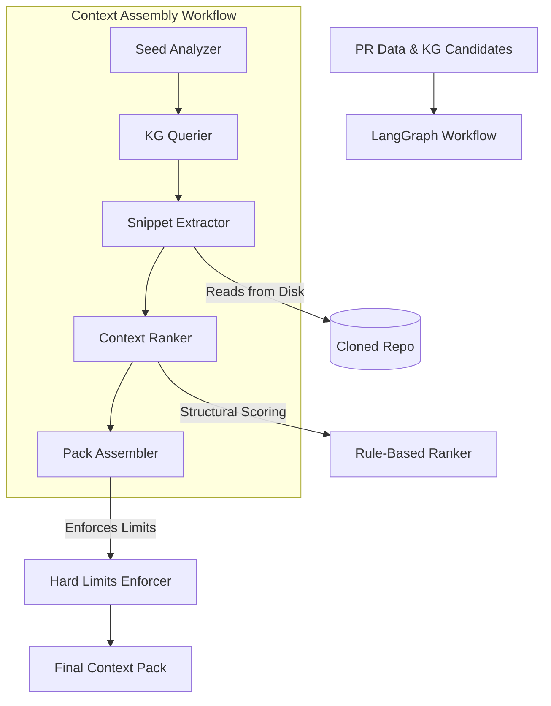

# Context Assembly System

**Production-grade intelligent context assembly for AI-powered code reviews.**

## Overview

The Context Assembly System transforms raw PR data and Knowledge Graph relationships into a high-quality, ranked context pack. It bridges the gap between metadata (line numbers, symbol names) and actual code content by extracting snippets from the cloned repository.

## End-to-End Flow



## Key Components

### 1. LangGraph Orchestration (`langgraph_workflow.py`)
A 5-node state machine that handles the multi-step process of context building:
- **Seed Analyzer**: Prioritizes symbols found in the PR diff.
- **KG Querier**: Expands the context radius using Neo4j relationships.
- **Snippet Extractor**: Hydrates metadata with real code from the cloned repository.
- **Context Ranker**: Scores items using structural and semantic heuristics.
- **Pack Assembler**: Finalizes the pack with strict resource bounding.

### 2. Code Extraction (`file_snippet_extractor.py`)
A secure, high-performance service for reading code from disk:
- **Path Protection**: Prevents path traversal attacks.
- **Performance**: Uses file-content caching for 10x+ speedups in batch extractions.
- **Encoding**: Automatic detection (UTF-8, chardet) and binary file skipping.
- **Safety**: Enforces maximum line lengths and file size limits.

### 3. Rule-Based Ranking (`rule_based_ranker.py`)
A deterministic, cost-free ranking engine:
- **Scoring**: Uses `CALLS`, `CONTAINS`, and `IMPORTS` relationships.
- **Proximity**: Considers file system distance and naming similarity.
- **Deduplication**: Filters out redundant context items using similarity thresholds.

## Hard Limits & Safety

| Limit | Value | Description |
|-------|-------|-------------|
| **Max Items** | 35 | Maximum number of context items in a pack |
| **Max Characters** | 120,000 | Total character limit for LLM prompt safety |
| **Max Lines** | 120 | Maximum lines per individual code snippet |
| **Max File Size** | 10 MB | Maximum file size for extraction safety |
| **Timeout** | 300s | Maximum execution time for the workflow |

## Error Handling & Fault Tolerance

- **Circuit Breaker**: Protects the system from Neo4j or File System failures.
- **Graceful Degradation**: Falls back to mock extraction or minimal context if critical errors occur.
- **Validation**: Strict Pydantic schema enforcement at every step.

## Usage

```python
from src.services.pr_review.context_assembly import ContextAssemblyService

service = ContextAssemblyService()

context_pack = await service.assemble_context(
    repo_id=repo_id,
    github_repo_name="owner/repo",
    pr_number=123,
    head_sha="abc123",
    seed_set=seed_set,
    patches=pr_patches,
    kg_candidates=kg_candidates,
    clone_path="/tmp/repo-clone",  # Critical for real code extraction
    limits=limits
)

print(f"Generated {len(context_pack.context_items)} context items")
```

## Rule-Based Scoring

The ranker uses structural relationships from the Knowledge Graph:

- **Seed symbols**: +0.8 (highest priority)
- **Changed files**: +0.6
- **CALLS relationship**: +0.5
- **CONTAINS relationship**: +0.3
- **File proximity**: +0.3
- **Documentation**: +0.1

## Code Structure

```
src/services/pr_review/context_assembly/
├── service.py              # Main service
├── context_graph.py        # Integration wrapper
├── langgraph_workflow.py   # 5-node workflow
├── rule_based_ranker.py    # Relevance scoring
├── hard_limits_enforcer.py # Resource limits
├── circuit_breaker.py      # Fault tolerance
├── exceptions.py           # Error handling
└── __init__.py             # Exports
```
